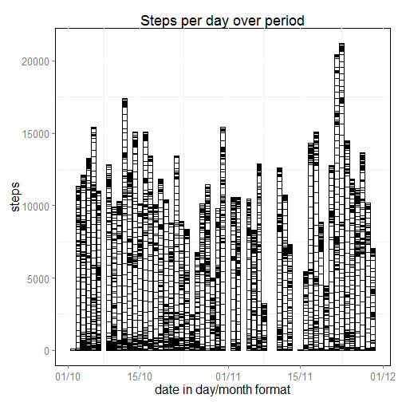
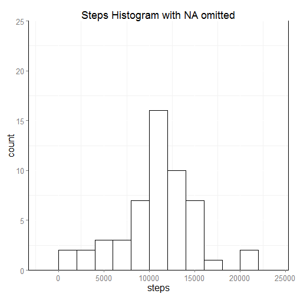
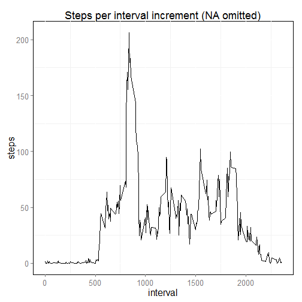
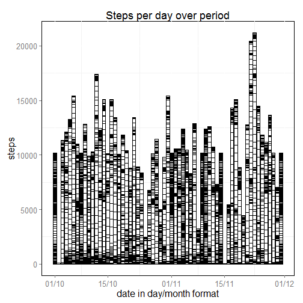
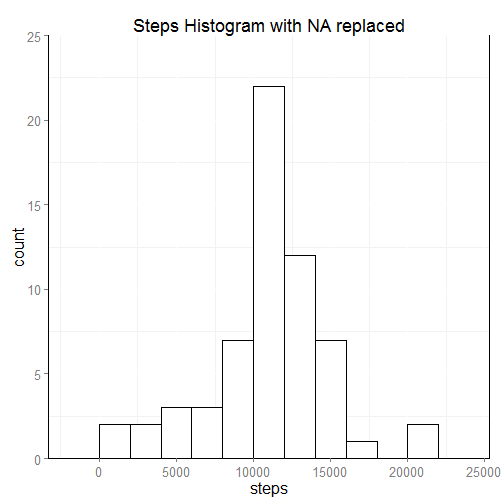
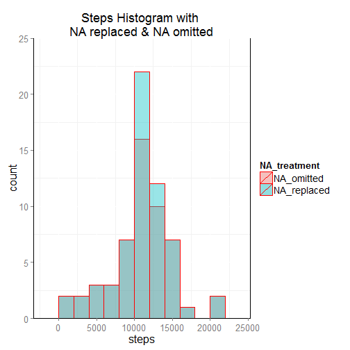
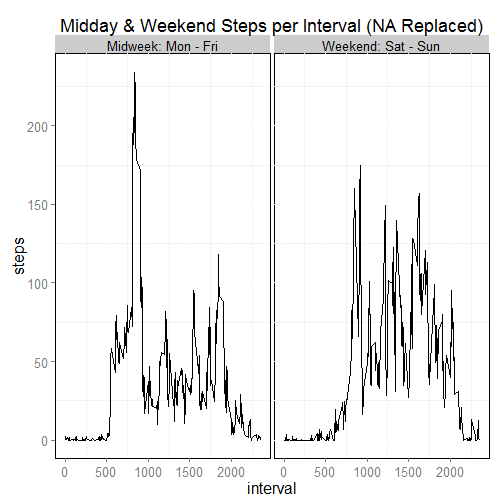

# Introduction

This work documents the analysis taken on a dataset taken form a personal activity monitoring device (e.g., Fitbit, Jawbone, Nike Fuelband, etc.., ). The device collects data at 5 minutes intervals throughout the day.

**The data for this assignment can be downloaded from the course web site**:

**Dataset**: [Activity monitoring data [size 52kB]](https://d396qusza40orc.cloudfront.net/repdata%2Fdata%2Factivity.zip)

The variables in the activity dataset are defined as follows:

**steps**: Number of steps taking in a 5-minute interval with missing values coded as `NA`.

**date**: The date on which the measurement was taken in YYYY-MM-DD format.

**interval**: Identifier for the 5-minute interval in which measurement was taken.


The dataset is stored in a comma-separated-value (CSV) file and there are a total of 17,568 observations in this dataset.


# The Pre-requisites

The following libraries are being used (**note**: in case these are already present they will not be downloaded again. Only the library itself will be activated by calling the `library()` function);


```r
# LIBRARIES UZED

if("knitr" %in% rownames(installed.packages()) == FALSE) {install.packages("knitr")}
library(knitr)

if("lubridate" %in% rownames(installed.packages()) == FALSE) {install.packages("lubridate")}
library(lubridate)

if("stargazer" %in% rownames(installed.packages()) == FALSE) {install.packages("stargazer")}
library(stargazer)
```

```
## 
## Please cite as: 
## 
##  Hlavac, Marek (2014). stargazer: LaTeX code and ASCII text for well-formatted regression and summary statistics tables.
##  R package version 5.1. http://CRAN.R-project.org/package=stargazer
```

```r
if("ggplot2" %in% rownames(installed.packages()) == FALSE) {install.packages("ggplot2")}
library(ggplot2)

if("scales" %in% rownames(installed.packages()) == FALSE) {install.packages("scales")}
library(scales)
```

and have the following supporting functions defined


```r
# DEFINED FUNCTIONS

save_png <- function(n,d) {
        
## Function `save_png` save a png formatted chart named `n`
## to specified directory 'd`
        
        setwd(d)
        
        dev.copy(png,n)
        dev.off()
        
        setwd("../")
}


UnZipped <- function(DataDir, fileUrl) {
        
## Function `UnZipped` checks;
### Does DataDir already exists.
### IF not then create DataDir and unzip the dataset into it DataDir.

if (file.exists(DataDir) == FALSE) {
        
        dir.create(DataDir)
        setwd(DataDir)
        
        t <- tempfile()

        download.file(fileUrl, t, mode = "wb")
        
        unzip(t)
        unlink(t)
        
        setwd("../")   
    }
}

DataExist <- function(DataDir, DataSet) {

## Function DataExist checks;
### Is the dataset indeed included in the DataDir.
### If not unzip and add DataSet to DataDir.
        
setwd(DataDir)

if (file.exists(DataSet) == FALSE) {
        
        t <- tempfile()
        
        download.file(fileUrl, t, mode = "wb")
        
        unzip(t)
        unlink(t)
        
    }

setwd("../")

}

myTheme <- function() {

## Function defines the ggplot2 Theme
## to be used in the ggplot2 plots.
## ensuring all plots are reasonably standardized.
        
        p <- theme(
              text = element_text(size = 16),
              plot.title = element_text(size = 18),
              axis.text.x = element_text(angle = 0, vjust = 1),
              axis.line = element_line(color = "black"),
              legend.text = element_text(size = 14),
              panel.background = element_rect(fill = "white", colour = "black"))
        
}
```

# Loading & pre-processing the activity data.

The strategy of the loading & pre-processing the activity data is to enable the remote zip file to be directly downloaded in the `"./dataset"` directory (i.e., created in the working directory). It should be loaded only once. Thus, on repeated runs of the code, the code will not re-load the dataset. Furthermore, once the `.csv` file has been loaded to the dataframe and the pre-processing of the dataset has been carried out, the code should not repeatedly run through this process when the code is executed subsequently.


```r
# MAIN ENVIRONMENT

## DATASET DIRECTORY
### Creates directory and extract from the zip file the orinal data which should
### is then stored here.

fileUrl <- "https://d396qusza40orc.cloudfront.net/repdata%2Fdata%2Factivity.zip"
DataDir <- "./dataset" #this is the directory where original data is to be found
DataSet <- "activity.CSV"
```

The following code segment check whether the `dataActivity` dataframe representing the dataset exist.

- If `dataActivity` dataframe **does not exist** (i.e., first time the R code would run) then the R code will read the dataset to the dataframe.

- if `dataActivity` **does exist** the code will omit re-doing this step again.


```r
### create figure directory where all graphic plots will be saved.

resultsDir <- "./figures" 
if (file.exists(resultsDir) == FALSE) dir.create(resultsDir)

### check whether the dataframe, read from the dataFile, exists.
### if it exist it does not re-read it.

dataFile <- file.path(DataDir, DataSet)

l <- ifelse(any(ls() %in% "dataActivity"), is.data.frame(get("dataActivity")),FALSE)

if (l == FALSE) { dataActivity <- read.table(dataFile, 
                                             header = TRUE,
                                             sep = ",",
                                             na.strings = "NA", 
                                             colClasses = c("numeric",
                                                            "factor",
                                                            "numeric"))
                  
                  dataActivity$date <- as.Date(dataActivity$date,"%Y-%m-%d")
                  
                  weekday <-  wday(dataActivity$date, label = TRUE, abbr = TRUE)
                  dayno <-  wday(dataActivity$date, label = FALSE)
                  
                  ### Creating a factor variable daytype that has two values
                  ### 1: mw = mid-week (Monday - Friday)
                  ### 2: we = weekend (Saturday - Sunday)
                  
                  daytype <- ifelse(dayno > 1 & dayno < 7,"mw","we")

                  ### As it will be interesting to see whether there are any differences between
                  ### different days during the week (e.g., weekends versus weekdays)
                  ### I add a column whic maps the date into the weekday character description.
                  ### and whether the day is a weekend (we) or a mid-week day (mw).
                  
                  dataActivity <- cbind(dataActivity,weekday,daytype)                          
}
```

As i want to prepare the dataset for the questions coming later, I am in the above code segment adding two columns extra;
1. One with the weekday character description (i.e., Mon, Tue, ... Sat, Sun).
2. One with the daytype characteristics. Either mid-week day (i.e., Monday to Friday) and abbreviated with `mw`, or weekend (i.e., Saterday and Sunday) abbreviated with `we`.

The structure (i.e., `str()`) of the `dataActivity` dataframe is;


```r
str(dataActivity)
```

```
## 'data.frame':	17568 obs. of  5 variables:
##  $ steps   : num  NA NA NA NA NA NA NA NA NA NA ...
##  $ date    : Date, format: "2012-10-01" "2012-10-01" ...
##  $ interval: num  0 5 10 15 20 25 30 35 40 45 ...
##  $ weekday : Ord.factor w/ 7 levels "Sun"<"Mon"<"Tues"<..: 2 2 2 2 2 2 2 2 2 2 ...
##  $ daytype : Factor w/ 2 levels "mw","we": 1 1 1 1 1 1 1 1 1 1 ...
```

The `weekday` and `daytype` columns have been added to the original dataset. Also note that there are `NA`s in the `steps` activity measurements as well.

The summary of `dataActivity` tells us the following;


```r
summary(dataActivity)
```

```
##      steps             date               interval       weekday    
##  Min.   :  0.00   Min.   :2012-10-01   Min.   :   0.0   Sun  :2304  
##  1st Qu.:  0.00   1st Qu.:2012-10-16   1st Qu.: 588.8   Mon  :2592  
##  Median :  0.00   Median :2012-10-31   Median :1177.5   Tues :2592  
##  Mean   : 37.38   Mean   :2012-10-31   Mean   :1177.5   Wed  :2592  
##  3rd Qu.: 12.00   3rd Qu.:2012-11-15   3rd Qu.:1766.2   Thurs:2592  
##  Max.   :806.00   Max.   :2012-11-30   Max.   :2355.0   Fri  :2592  
##  NA's   :2304                                           Sat  :2304  
##  daytype   
##  mw:12960  
##  we: 4608  
##            
##            
##            
##            
## 
```

The summary shows that the `steps` data have 2,304 `NA` entries.


```r
opts_chunk$set(fig.path="./figures")

## PLOT NUMBER OF STEPS PER DAY.
### Each step interval per day is represented by a bar segment on the daily bar. 

g0 <- ggplot(dataActivity, aes(x = date, y = steps))
g0 <- g0 + geom_bar(col = "black", fill = "white", stat = "identity")
g0 <- g0 + labs(title = "Steps per day over period", x = "date in day/month format")
g0 <- g0 + scale_x_date(labels = date_format("%d/%m"))
g0 <- g0 + myTheme()
```

**Note** the warning inserted by the `ggplot2` code relates to omitting the 2,304 `NA` values in the plot.


```r
print(g0)
```

```
## Warning in loop_apply(n, do.ply): Removed 2304 rows containing missing
## values (position_stack).
```

 

```r
save_png("plot0.png",resultsDir)
```

It is always instructive to make simpler plots on the relevant data to get a feelling for the structure of data. The above `ggplot2` plot shows the number of steps made per day, over the period represented by the activity dataset. In this plot every block represents one activity time interval and shows (not surprisingly) that different days have different activity dynamics. Further we also see that there are days where no measurement were made at all. This typically represented by a `NA` in the original dataset. 

# What is the mean total number of steps taken per day 

In the following activity analysis represented by number of steps, the `NA`s have been omitted.


```r
## PART 1: MEAN TOTAL NUMBER OF STEPS TAKEN PER DAY

### Total number of steps per day
### Omitting the NA

stepsperDay <- aggregate(steps ~ date, dataActivity, FUN = sum, na.action = na.omit)
lenDayswoNA <- length(stepsperDay$steps)

### Identifying total number of days in dataset including days without a measurement

stepsperDaywNA <- aggregate(steps ~ date, dataActivity, FUN = sum, na.action = na.pass)
lenDayswNA <- length(stepsperDaywNA$steps)

### Days with no steps identified;

daysENA <- lenDayswNA - lenDayswoNA
```

We can easily calculate the equivalent days with no (or invalid) `step` measurements. Take the difference of the length of the `step` measurement with and without considering `NA`. The equivalent number of days with an `NA` entry is


```r
print(daysENA)
```

```
## [1] 8
```

From the dataframe `dataActivity` with the `NA`s omitted, we can create a histogram, using `ggplot2` of the number of steps made over the period (note: the `ggplot2` `theme` has been defined in the above function `myTheme()`);


```r
## PLOT HISTOGRAM OF TOTAL NUMBER OF STEPS PER DAY WITH NA REPLACED
g1 <- ggplot(stepsperDay, aes(x = steps))
g1 <- g1 + geom_histogram(binwidth=2000, fill = "white", col = "black", alpha=1.0, position="identity")
g1 <- g1 + coord_cartesian(ylim = c(0,25))
g1 <- g1 + labs(title = "Steps Histogram with NA omitted") 
g1 <- g1 + myTheme()

print(g1)
```

 

```r
save_png("plot1.png",resultsDir)
```

The mean and median (i..e, 50%-percentile) is summerized in the table below (i.e, using the `stargazer` library);


```r
### Mean & Median (i.e., 50%-pectentile) steps per dat over the period.
### NA has been ommitted.
### using `stargazer` library

stargazer(stepsperDay, type = "text", title = "Daily Steps statistics (NA omitted)",
          digits = 0,
          summary.logical = TRUE,
          nobs = TRUE,
          mean.sd = TRUE,
          min.max = FALSE,
          median = TRUE,
          flip = TRUE)
```

```
## 
## Daily Steps statistics (NA omitted)
## ================
## Statistic steps 
## ----------------
## N           53  
## Mean      10,766
## St. Dev.  4,269 
## Median    10,765
## ----------------
```

The `nobs` represents the number of observed days with valid `steps` measurements.

# What is the average daily activity pattern?


```r
stepsperInterval <- aggregate(steps ~ interval, dataActivity, FUN = mean, na.action = na.omit)

## PLOT NUMBER OF STEPS PER INTERVAL INCREMENT.

g2 <- ggplot(stepsperInterval, aes(x = interval, y = steps))
g2 <- g2 + geom_line()
g2 <- g2 + labs(title = "Steps per interval increment (NA omitted)")
g2 <- g2 + myTheme()

print(g2)
```

 

```r
save_png("plot2.png",resultsDir)

### Maximum number of `steps` averaged across all days
MaxSteps <- max(stepsperInterval$steps)

### The 5-minute interval containing the maximum number of steps
interval <- stepsperInterval$interval[stepsperInterval$steps==MaxSteps]

### Round MaxSteps to nearest whole integer
atMaxSteps <- round(MaxSteps,0)

### The 5-minute interval at maxium steps 
tb1 <- cbind(interval, atMaxSteps)
```

`interval` at the maximum number of `steps` 


```r
print(tb1)
```

```
##      interval atMaxSteps
## [1,]      835        206
```

# Inputting missing values

**The strategy to filling in all missing values in the dataset:** The strategy I have taken in this analysis is to split of the `dataActivity` into a **midday** (`mw`) and a **weekend** (`we`) subset. On these subsets I am calculating the average midday & weekend step profiles (omitting `NA`s) as a function of the step measurement `interval1`. The next step is then to replace mid-week days `NA`s with the average mid-week acivity profile and replace weekend `NA`s with the average weekend activity profile (**note this completes the 2nd part of this sections task**).

Note in prinicple this strategy will lead to boost the peak of the distribution which might be incorrect as those missing NAs might as well be a 0 activity data point. Alternative replacement methodologies might be interpolation between two existing daily profiles, which only leads to an end-points problem that might be taken as non-activity days (i.e., all zeroes).


```r
## PART 3: MISSING VALUES (i.e., THE NA's)

### Strategy will be to replace mid-week days NAs with the average mid-week acivity profile
### and replace weekend NAs with the average weekend activity profile.
### Note in prinicple this strategy will lead to boost the peak of the distribution
### which might be incorrect as those missing NAs might as well be a 0 activity data point.

dataActivityNew <- dataActivity

### Number of `NA`'s in the step data/column
intervalswNA <- length(dataActivity$steps[is.na(dataActivity$steps)==TRUE])

### Total number of 5-min intervals with `steps` `NA` (e.g., no measurement)
### and the `NA` equivalent number of days 
tb2 <- cbind(intervalswNA,daysENA)
```

The above coding segment finds the amount of `interval`s with the step value `NA` (`intervalswNA`) and the equivalent number of days (`daysENA`)


```r
print(tb2)
```

```
##      intervalswNA daysENA
## [1,]         2304       8
```

**Note: The above Table is the answer to this sections first question.**

The following R code implements the above described strategy by subsetting the orinal dataset into a **midweek** and a **weekend** dataset; 


```r
### Midweek Reference steps per interval function
dataMidweek <- dataActivity[dataActivity$daytype == "mw",]
Midweek <- aggregate(steps ~ interval, dataMidweek, FUN = mean, na.action = na.omit)

lenMW <- length(Midweek$steps)
lenMWNA <- length(dataMidweek$interval[is.na(dataMidweek$steps)])

n <-  round(lenMWNA/lenMW)

Midweek <- Midweek[rep(seq_len(nrow(Midweek)),n),]

xMW <- Midweek$steps[Midweek$interval == dataMidweek$interval[is.na(dataMidweek$steps)]]

dataMidweek$steps[is.na(dataMidweek$steps)] <- xMW

### Replace Midweek (mw) NA's with the average Midweek step activity

dataActivityNew$steps[dataActivity$daytype == "mw" & is.na(dataActivity$steps)] <- xMW

### Weekend Reference steps per interval function
dataWeekend <- dataActivity[dataActivity$daytype == "we",]
Weekend <- aggregate(steps ~ interval, dataWeekend, FUN = mean, na.action = na.omit)

lenWE <- length(Weekend$steps)
lenWENA <- length(dataWeekend$interval[is.na(dataWeekend$steps)])

n <-  round(lenWENA/lenWE)

Weekend <- Weekend[rep(seq_len(nrow(Weekend)),n),]

xWE <- Weekend$steps[Weekend$interval == dataWeekend$interval[is.na(dataWeekend$steps)]]

dataWeekend$steps[is.na(dataWeekend$steps)] <- xWE

### Replace Weekend (we) NA's with the average weekend step activity
dataActivityNew$steps[dataActivity$daytype == "we" & is.na(dataActivity$steps)] <- xWE
```

Hereby the structure of the new dataset with the missing (`steps`) values filled in;


```r
str(dataActivityNew)
```

```
## 'data.frame':	17568 obs. of  5 variables:
##  $ steps   : num  2.333 0.462 0.179 0.205 0.103 ...
##  $ date    : Date, format: "2012-10-01" "2012-10-01" ...
##  $ interval: num  0 5 10 15 20 25 30 35 40 45 ...
##  $ weekday : Ord.factor w/ 7 levels "Sun"<"Mon"<"Tues"<..: 2 2 2 2 2 2 2 2 2 2 ...
##  $ daytype : Factor w/ 2 levels "mw","we": 1 1 1 1 1 1 1 1 1 1 ...
```

and the following provide the summary of the new dataset showing that there no longer are missing values present;


```r
summary(dataActivityNew)
```

```
##      steps             date               interval       weekday    
##  Min.   :  0.00   Min.   :2012-10-01   Min.   :   0.0   Sun  :2304  
##  1st Qu.:  0.00   1st Qu.:2012-10-16   1st Qu.: 588.8   Mon  :2592  
##  Median :  0.00   Median :2012-10-31   Median :1177.5   Tues :2592  
##  Mean   : 37.37   Mean   :2012-10-31   Mean   :1177.5   Wed  :2592  
##  3rd Qu.: 24.00   3rd Qu.:2012-11-15   3rd Qu.:1766.2   Thurs:2592  
##  Max.   :806.00   Max.   :2012-11-30   Max.   :2355.0   Fri  :2592  
##                                                         Sat  :2304  
##  daytype   
##  mw:12960  
##  we: 4608  
##            
##            
##            
##            
## 
```

```r
## PLOT NUMBER OF STEPS PER DAY.
### Each step interval per day is represented by a bar segment on the daily bar. 

g3 <- ggplot(dataActivityNew, aes(x = date, y = steps))
g3 <- g3 + geom_bar(col = "black", fill = "white", stat = "identity")
g3 <- g3 + labs(title = "Steps per day over period", x = "date in day/month format")
g3 <- g3 + scale_x_date(labels = date_format("%d/%m"))
g3 <- g3 + myTheme()
```

The below `ggplot2` plot shows the number of steps made per day, over the period represented by the activity dataset. In this plot every block represents one activity time interval and shows (not surprisingly) that different days have different activity dynamics. Further we also see that after the replacement (or "filling in") of there are no longer days with no measurement (i.e., `NA`s). It should however be noted that there are two days 0 `steps` measurements (as opposed to `NA` entries).


```r
print(g3)
```

 

```r
save_png("plot3.png",resultsDir)
```

The new "infilled"" dataset `dataActivityNew` is illustrated by structure (i.e., `str()`), the `summary()` and the `ggplot2` plot above. **This concludes the answer to this section's 3rd task**.


```r
## CONSOLIDATING DATA FOR STEPS WITH NA REPLACED & STEPS WITH NA OMITTED
### need this to plot the two data sets together for visual inspection.

stepsperDayNew <- aggregate(steps ~ date, dataActivityNew, FUN = sum, na.action = na.pass)

l1 <- length(stepsperDayNew$steps)
yy1 <- rep("NA_replaced",l1)
yy2 <- stepsperDayNew$steps

yy  <- cbind(yy1,yy2)


l2 <- length(stepsperDay$steps)
xx1 <- rep("NA_omitted",l2)
xx2 <- stepsperDay$steps

xx  <- cbind(xx1,xx2)
    
zz <- rbind(yy,xx)
zz <- as.data.frame(zz)
names(zz) <- c("NA_treatment","steps")
zz$steps <- as.numeric(levels(zz$steps)[zz$steps])

## PLOT HISTOGRAM OF TOTAL NUMBER OF STEPS PER DAY WITH NA REPLACED
g4 <- ggplot(stepsperDayNew, aes(x = steps))
g4 <- g4 + geom_histogram(binwidth=2000, fill = "white", col = "black", alpha=1.0, position="identity")
g4 <- g4 + coord_cartesian(ylim = c(0,25))
g4 <- g4 + labs(title = "Steps Histogram with NA replaced") 
g4 <- g4 + myTheme()

print(g4)
```

 

```r
save_png("plot4.png",resultsDir)
```

The above `ggplot2` should be compared with the above `"Steps Histogram with NA omitted"` histogram plot, for which `NA` was omitted in the analysis. As can be seen here "the peak of the distribution" is being emphasized more by the chosen strategy. Mean and Median (i.e., 50-percentile are moving further away from each other). However, it is questionable whether such comparison is really very meaningful as the `midweek` and `weekend` activity profiles are very different. Particular as this analysis have chosen an infill strategy based on the de-composed activity profiles of **midweek** and **weekend**. 

The mean and median is tabulated below using the `stargazer` library;


```r
stepsperDayNew <- aggregate(steps ~ date, dataActivityNew, FUN = sum, na.action = na.omit)

stargazer(stepsperDayNew, type = "text", title = "Daily Steps statistics (NA replaced)",
          digits = 0,
          summary.logical = TRUE,
          nobs = TRUE,
          mean.sd = TRUE,
          min.max = TRUE,
          median = TRUE,
          flip = TRUE)
```

```
## 
## Daily Steps statistics (NA replaced)
## ================
## Statistic steps 
## ----------------
## N           61  
## Mean      10,762
## St. Dev.  3,990 
## Min         41  
## Median    10,571
## Max       21,194
## ----------------
```

**Note: the above histogram and Table of mean & the median addresses the fourth and last question of this section.**

For comparison this can be compared with the Table (also shown previously above) when `NA` is omitted from the anaysis;


```r
stargazer(stepsperDay, type = "text", title = "Daily Steps statistics (NA omitted)",
          digits = 0,
          summary.logical = TRUE,
          nobs = TRUE,
          mean.sd = TRUE,
          min.max = TRUE,
          median = TRUE,
          flip = TRUE)
```

```
## 
## Daily Steps statistics (NA omitted)
## ================
## Statistic steps 
## ----------------
## N           53  
## Mean      10,766
## St. Dev.  4,269 
## Min         41  
## Median    10,765
## Max       21,194
## ----------------
```


It is instructive to overlay the `steps` histograms of `NA` omitted and `NA` replaced as it is easier to quickly oversee the difference between the two strategies.


```r
## PLOT HISTOGRAM OF TOTAL NUMBER OF STEPS PER DAY WITH NA REPLACED & NA OMITTED
g5 <- ggplot(zz, aes(x = steps, fill = NA_treatment))
g5 <- g5 + geom_histogram(binwidth=2000, col = "red", alpha=0.4, position="identity")
g5 <- g5 + coord_cartesian(ylim = c(0,25))
g5 <- g5 + labs(title = "Steps Histogram with \nNA replaced & NA omitted") 
g5 <- g5 + myTheme()

print(g5)
```

 

```r
save_png("plot5.png",resultsDir)
```

# Are there differences in activity patterns between weekdays & weekends

First lets be clear about language. Instead of talking about a weekday, I prefer to define a **midweek** day as being Monday to Friday. The weekend is in this analysis defined as Saturday & Sunday (note: in many Islamic based cultures this definition is not correct).

secondly, the new factor variable was created in the very beginning of the code when loading the original dataset into the dataframe `dataActivity`. **Thus first part of this sections task has already been achieved previously.**

Above the effort was already made to subset the `dataActivity` dataframe into a `midweek` and a `weekend` part. Tables below summarizing the **midweek** and **weekend** distributions with `NA`s replaced.


```r
## TABLES SUMMARY

stepsperMidweekDay <- aggregate(steps ~ date, dataMidweek, FUN = sum, na.action = na.omit)

stargazer(stepsperMidweekDay, type = "text", title = "Daily Steps per Midweek statistics (NA replaced)",
          digits = 0,
          summary.logical = TRUE,
          nobs = TRUE,
          mean.sd = TRUE,
          min.max = TRUE,
          median = TRUE,
          flip = TRUE)
```

```
## 
## Daily Steps per Midweek statistics (NA replaced)
## ================
## Statistic steps 
## ----------------
## N           45  
## Mean      10,177
## St. Dev.  4,359 
## Min         41  
## Median    10,177
## Max       21,194
## ----------------
```

```r
stepsperWeekendDay <- aggregate(steps ~ date, dataWeekend, FUN = sum, na.action = na.omit)

stargazer(stepsperWeekendDay, type = "text", title = "Daily Steps per Weekend statistics (NA replaced)",
          digits = 0,
          summary.logical = TRUE,
          nobs = TRUE,
          mean.sd = TRUE,
          min.max = TRUE,
          median = TRUE,
          flip = TRUE)
```

```
## 
## Daily Steps per Weekend statistics (NA replaced)
## ================
## Statistic steps 
## ----------------
## N           16  
## Mean      12,407
## St. Dev.  2,006 
## Min       8,821 
## Median    12,407
## Max       15,420
## ----------------
```

This already clearly evidence that the distributions for midweek and weekend are very different. Weekend distribution has the higest mean (& median) compared to the midweek distribution but also a narrower distribution with the standard deviation being less than half of the midweek distributions standard deviation.

The short answer to this section's question is: **Yes! there are substantial differences in the activity patterns between the midweek and the weekend distribution.** 


```r
## Constructing the midweek & weekend step activity plot.
## Illustrated data are for NA replaced.

stepsperIntervalDaytype <- aggregate(steps ~ interval + daytype, dataActivityNew, FUN = mean, na.action = na.omit)

daytypeNames <- list(
        "mw" = "Midweek: Mon - Fri",
        "we" = "Weekend: Sat - Sun"
        )

daytypeLabeller <- function(variable,value) {
        return(daytypeNames[value])
}

g6 <- ggplot(stepsperIntervalDaytype, aes(x = interval, y = steps, group = daytype))
g6 <- g6 + geom_line()
g6 <- g6 + labs(title = "Midday & Weekend Steps per Interval (NA Replaced)") 
g6 <- g6 + myTheme()
g6 <- g6 + facet_wrap(~ daytype)
g6 <- g6 + facet_grid(.~ daytype, labeller=daytypeLabeller)
```

To construct the `ggplot2` plot, I m using `facet_wrap()` to split it into two sections, showing the data for **midweek** as well as **weekend**, Further, I am renaming the labels from the coding convinient `mw` and `we` to something more describing, i.e., `mw = "Midweek: Mon - Fri"` and `we = "Weekend: Sat - Sun"`. `ggplot2`'s `facet_grid()` firstly positions the two facets and adds the more descriptive labels.  


```r
print(g6)
```

 

```r
save_png("plot6.png",resultsDir)
```

Not surprisingly there is a big difference in the step activity beetween that of a midweek day and of a weekend day.

**Hereby concluding the Project 1 of Coursera re-data-014 as of May 2015.**
